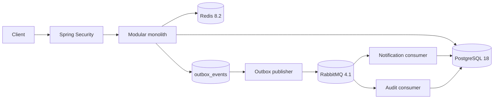

# LedgerBank

LedgerBank adalah simulator core banking edukasional berbasis Java. Aplikasi menyediakan registrasi dan login, rekening IDR, deposit, withdrawal, transfer internal atomik, histori transaksi, ownership enforcement, dan perlindungan idempotency. Aplikasi tidak terhubung ke bank atau payment rail dan tidak ditujukan untuk transaksi finansial produksi.

## Why this project exists

Project ini adalah portfolio backend engineering untuk memperlihatkan konsistensi transaksi, security boundary, reliability event, observability, pengujian lintas infrastructure, serta optimasi berbasis bukti. LedgerBank bukan sistem perbankan production dan tidak menyatakan compliance, availability, security certification, atau kapasitas yang belum dibuktikan.

Implementasi mencakup Milestone 1-3:

- M1: customer, rekening, deposit, withdrawal, transfer atomik, dan histori transaksi;
- M2: authentication, role dan ownership, OpenAPI, Redis session/idempotency, RabbitMQ, notification, dan audit;
- M3: Testcontainers integration/concurrency suite, transactional outbox, Actuator/Micrometer, correlation logging, performance/JVM/database analysis, automation, Linux compatibility, CI, dan quality checks.

## Arsitektur ringkas



PostgreSQL adalah source of truth. Mutasi saldo, histori, transfer, durable idempotency record, dan event outbox disimpan dalam transaction boundary yang sesuai. Redis menyediakan session serta koordinasi/cache idempotency. RabbitMQ mengirim event secara at-least-once; consumer PostgreSQL idempotent mencegah duplikasi akibat redelivery.

## Stack

- LedgerBank 1.0.0 release candidate; Java 25, Spring Boot 4.1.1, Maven Wrapper.
- Spring MVC, Spring Data JPA, Bean Validation, Spring Security.
- PostgreSQL 18 dan Flyway. PostgreSQL adalah satu-satunya relational database; tidak ada MariaDB.
- Redis 8.2 untuk opaque authentication session dan transfer idempotency.
- RabbitMQ 4.1 untuk banking event, notification, dan audit processing asynchronous.
- Spring Boot Actuator, Micrometer, dan Prometheus registry untuk health dan metrics.
- springdoc-openapi 3.1.1, JUnit Jupiter 6, Mockito, Spring MVC Test, dan Testcontainers.

## Menjalankan aplikasi

Untuk menjalankan seluruh stack hanya dengan Docker, prasyaratnya cukup Docker Desktop dengan Docker Compose v2:

```powershell
Copy-Item .env.example .env
docker compose up --build -d --wait
```

Perintah tersebut membangun image LedgerBank, lalu menjalankan aplikasi, PostgreSQL, Redis, dan RabbitMQ. API tersedia di [http://localhost:8080](http://localhost:8080). Lihat log aplikasi dengan `docker compose logs -f app` dan hentikan stack dengan `docker compose down`.

Untuk development dengan aplikasi berjalan langsung dari host, gunakan JDK 25 dan jalankan hanya infrastrukturnya melalui Docker:

```powershell
docker compose up -d --wait postgres redis rabbitmq
.\mvnw.cmd spring-boot:run
```

Default port development:

| Service | Port host |
|---|---:|
| API | 8080 |
| PostgreSQL | 5432 |
| Redis | 6380 |
| RabbitMQ AMQP | 5673 |
| RabbitMQ Management | 15673 |

Port Redis dan RabbitMQ sengaja tidak memakai port umum 6379/5672 agar tidak mudah bentrok dengan service lokal lain. Semua port Compose dipublikasikan hanya ke loopback.

Jika PostgreSQL 18 sudah tersedia secara lokal, isi `DB_URL`, `DB_USERNAME`, dan `DB_PASSWORD`, lalu cukup jalankan Redis dan RabbitMQ:

```powershell
docker compose up -d --wait redis rabbitmq
.\mvnw.cmd spring-boot:run
```

Flyway menjalankan migration V1-V8 saat startup dan Hibernate hanya memvalidasi schema.

## Authentication dan authorization

Registrasi selalu membuat user `CUSTOMER` yang terhubung satu-ke-satu dengan customer. Password 12-72 karakter printable ASCII disimpan sebagai BCrypt hash. Login menghasilkan opaque bearer token acak; hanya hash token dan metadata session yang disimpan di Redis dengan TTL default delapan jam.

```powershell
$base = 'http://localhost:8080/api/v1'

$user = Invoke-RestMethod -Method Post -Uri "$base/auth/register" `
  -ContentType 'application/json' `
  -Body '{"fullName":"Budi Santoso","email":"budi@example.com","password":"correct horse battery"}'

$login = Invoke-RestMethod -Method Post -Uri "$base/auth/login" `
  -ContentType 'application/json' `
  -Body '{"email":"budi@example.com","password":"correct horse battery"}'

$headers = @{ Authorization = "Bearer $($login.accessToken)" }
```

Semua banking endpoint selain health memerlukan bearer token. Customer hanya dapat membaca customer/rekening/histori miliknya dan hanya dapat mengubah saldo atau transfer dari rekening miliknya. Admin dapat membaca data operasional dan membuat customer, tetapi tidak dapat melakukan mutasi uang sebagai customer. Admin opsional dibuat saat startup melalui `APP_ADMIN_EMAIL` dan `APP_ADMIN_PASSWORD`; role tidak dapat dipilih dari endpoint publik.

Logout menghapus session Redis:

```powershell
Invoke-RestMethod -Method Post -Uri "$base/auth/logout" -Headers $headers
```

## Transfer idempotency

`POST /api/v1/transfers` wajib membawa `Idempotency-Key` unik sepanjang 8-128 karakter.

```powershell
$transferHeaders = @{
  Authorization = "Bearer $($login.accessToken)"
  'Idempotency-Key' = [guid]::NewGuid().ToString()
}
```

Request yang sama dengan key dan actor yang sama mengembalikan transfer sebelumnya tanpa mengubah saldo lagi. Key yang sama dengan payload berbeda menghasilkan 409. Redis menyediakan lock singkat dan cache TTL; tabel PostgreSQL `transfer_idempotency` disimpan atomik bersama transfer sebagai recovery durable. Jika Redis tidak tersedia sebelum transfer dimulai, API menolak request dengan 503.

## Swagger dan OpenAPI

- Swagger UI: [http://localhost:8080/swagger-ui.html](http://localhost:8080/swagger-ui.html)
- OpenAPI JSON: [http://localhost:8080/v3/api-docs](http://localhost:8080/v3/api-docs)
- OpenAPI YAML: [http://localhost:8080/v3/api-docs.yaml](http://localhost:8080/v3/api-docs.yaml)

Ketiga endpoint dokumentasi bersifat publik. OpenAPI berformat 3.0.1 dan mendokumentasikan 13 path serta bearer security scheme. Di Swagger UI, login terlebih dahulu lalu masukkan nilai `accessToken` melalui tombol **Authorize**.

## Redis dan RabbitMQ

Redis menyimpan:

- `auth:session:<sha256-token>` dengan TTL session;
- cache dan distributed lock idempotency transfer dengan key yang diturunkan dari actor dan idempotency key.

RabbitMQ mendeklarasikan topology durable saat aplikasi startup:

| Objek | Konfigurasi |
|---|---|
| Exchange | `ledgerbank.events`, topic, durable |
| Queue | `ledgerbank.notification`, durable |
| Queue | `ledgerbank.audit`, durable |
| Binding | `transfer.*` ke notification |
| Binding | `#` ke audit |

Event `USER_LOGIN`, `ACCOUNT_CREATED`, `TRANSFER_COMPLETED`, dan `TRANSFER_FAILED` diserialisasi sebagai JSON ke tabel `outbox_events` dalam transaction database. Publisher terjadwal meng-claim batch dalam transaction singkat, mengirim di luar transaction dengan publisher confirm, lalu menandai event `PUBLISHED` atau menjadwalkan retry exponential-backoff. Setelah delapan kegagalan, event menjadi `DEAD` untuk investigasi. Claim lease memulihkan event bila proses berhenti di tengah publish.

Notification consumer menyimpan notification transfer untuk customer sumber dan tujuan; audit consumer menyimpan seluruh event. Keduanya memakai insert idempotent agar redelivery tidak menggandakan record. Semantik delivery end-to-end adalah at-least-once, bukan exactly-once.

## Observability

- `GET /actuator/health`, liveness, readiness, dan info dapat diakses publik tanpa detail sensitif.
- `GET /actuator/metrics` dan `/actuator/prometheus` hanya dapat diakses ADMIN.
- Readiness memeriksa application state, PostgreSQL, dan Redis. RabbitMQ sengaja tidak menggagalkan readiness karena transaksi tetap dapat commit ke outbox saat broker offline.
- Header `X-Correlation-ID` divalidasi/dibuat untuk setiap request, dikembalikan pada response, dan masuk MDC log.
- Metric bisnis mencakup hasil/durasi transfer, outbox publish/retry/dead, delivery time, dan backlog per status.

## Konfigurasi

Lihat `.env.example`. Variabel utama:

| Variabel | Default |
|---|---|
| `DB_URL` | Dibentuk dari `DB_HOST`, `DB_PORT`, dan `DB_NAME` |
| `DB_USERNAME` / `DB_PASSWORD` | `ledgerbank` |
| `REDIS_PORT` / `REDIS_PASSWORD` | `6380` / `ledgerbank` |
| `RABBITMQ_PORT` | `5673` |
| `RABBITMQ_MANAGEMENT_PORT` | `15673` |
| `RABBITMQ_USERNAME` / `RABBITMQ_PASSWORD` | `ledgerbank` |
| `AUTH_SESSION_TTL` | `PT8H` |
| `TRANSFER_IDEMPOTENCY_TTL` | `PT24H` |
| `TRANSFER_IDEMPOTENCY_LOCK_TTL` | `PT30S` |
| `OUTBOX_BATCH_SIZE` / `OUTBOX_POLL_INTERVAL` | `50` / `PT0.5S` |
| `OUTBOX_MAX_ATTEMPTS` | `8` |
| `OUTBOX_INITIAL_BACKOFF` / `OUTBOX_MAX_BACKOFF` | `PT1S` / `PT1M` |
| `OUTBOX_CONFIRM_TIMEOUT` / `OUTBOX_CLAIM_LEASE` | `PT5S` / `PT30S` |
| `OUTBOX_RETENTION` | `P7D` |
| `PORT` | `8080` |

Jangan commit secret. Mengubah password PostgreSQL pada Compose tidak mengubah password volume database yang sudah terinisialisasi.

Konfigurasi umum berada di `application.yml`, koneksi development di `application-local.yml`, dan koneksi test di `application-test.yml`. Profile default adalah `local`; aktifkan profile lain melalui `SPRING_PROFILES_ACTIVE`.

## Test

Unit dan MVC test cepat:

```powershell
.\mvnw.cmd test
```

Verifikasi lengkap dengan PostgreSQL 18, Redis 8.2, dan RabbitMQ 4.1 Testcontainers serta quality profile:

```powershell
.\mvnw.cmd clean verify '-Pintegration,quality'
```

Pada Bash/Linux/WSL gunakan `./scripts/test.sh` atau `./scripts/integration-test.sh`. Verifikasi terakhir menghasilkan 95 unit/MVC test dan 24 integration test, seluruhnya tanpa failure, error, atau skip. Quality profile menjalankan compiler `-Xlint:all`, Checkstyle, SpotBugs, serta report JaCoCo unit dan integration.

Integration suite mencakup authentication/ownership, rollback, durable idempotency, RabbitMQ outage/recovery, consumer idempotency, outbox recovery, dan concurrency invariant untuk saldo serta lock ordering. Container memakai port dinamis dan tidak bergantung pada Compose development.

## Performance evidence

Workload reproducible pada workstation baseline menghasilkan:

| Flow | Throughput | p95 | Error |
|---|---:|---:|---:|
| History page 0, size 20 | 218,60 req/s | 27,77 ms | 0,00% |
| Transfer | 65,13 req/s | 87,76 ms | 0,00% |

Angka ini adalah baseline lokal, bukan SLA atau capacity claim. JFR/thread analysis menunjukkan hot-account contention dapat memenuhi connection pool, sementara PostgreSQL query plan menunjukkan index histori saat ini tepat untuk dataset uji. Karena belum ada bottleneck terukur, tidak dibuat migration index spekulatif. Lihat `docs/performance/` untuk environment, dataset, command, raw summary, dan keterbatasan.

## Automation dan CI

Script Bash di `scripts/` menyediakan startup development, test cepat, integration test, health check, dan reset database lokal yang dijaga konfirmasi/scope. `.gitattributes` memaksa LF untuk script dan Maven Wrapper pada Linux; Windows native dapat memakai `mvnw.cmd`.

Workflow GitHub Actions memakai Java 25 di Ubuntu, memvalidasi Maven Wrapper beserta checksum distribusi, menjalankan build/unit/quality, lalu integration suite Testcontainers. Report test failure dan report quality unit diunggah sebagai artifact. Detail penggunaan lokal ada di `docs/development.md`.

## Known limitations

- Notification dan audit belum memiliki endpoint publik; data tersedia sebagai persistence internal.
- Histori masih memakai offset pagination dan exact count; keyset pagination ditunda sampai dataset/SLO membuktikan kebutuhan.
- Hot account dapat menaikkan tail latency serta pressure pada worker/connection pool; tuning/rate limiting memerlukan target deployment.
- Tidak ada multi-region deployment, disaster-recovery exercise, external payment rail, fraud engine, atau compliance certification.
- Management endpoint hanya cocok dengan boundary aplikasi saat ini; deployment publik tetap memerlukan TLS, network policy, secret manager, monitoring, dan hardening operasional.

## Struktur

```text
src/main/java/com/example/ledgerbank/
  auth/           user, login, session Redis, principal, ownership policy
  customer/       customer dan endpoint administrasi/read
  account/        rekening dan ownership-aware query
  transaction/    deposit, withdrawal, histori
  transfer/       transfer atomik, idempotency Redis/PostgreSQL
  event/          banking event, transactional outbox, retry, dan publisher confirm
  notification/   RabbitMQ consumer dan notification persistence
  audit/          RabbitMQ consumer dan audit trail
  common/         error, correlation ID, metrics, security, OpenAPI, RabbitMQ
src/main/resources/db/migration/postgresql/
  V1-V8
```

Dokumentasi lanjutan:

- [Arsitektur](docs/architecture.md)
- [Database](docs/database.md)
- [Kontrak API](docs/api.md)
- [Security](docs/security.md)
- [Banking events](docs/events.md)
- [Redis](docs/redis.md)
- [Status implementasi](docs/IMPLEMENTATION_STATUS.md)
- [Development dan automation](docs/development.md)
- [Technical debt](docs/technical-debt.md)
- [Performance baseline](docs/performance/baseline.md)
- [JVM/thread profiling](docs/performance/jvm-analysis.md)
- [Database analysis](docs/performance/database-analysis.md)
