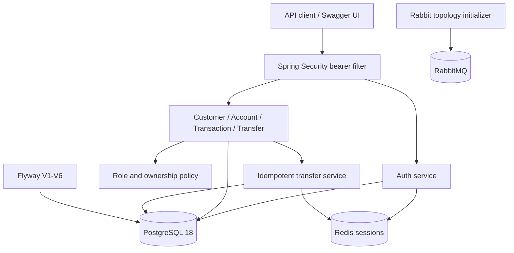

# Arsitektur sampai batas Milestone 2

LedgerBank tetap berupa modular monolith dengan package-by-feature. PostgreSQL 18 adalah satu-satunya relational database untuk seluruh milestone. Redis dan RabbitMQ adalah infrastructure pendukung, bukan pengganti source of truth PostgreSQL.



## Package dan tanggung jawab

| Package | Tanggung jawab |
|---|---|
| `auth` | App user, register/login/logout, BCrypt, opaque session, principal, role dan ownership policy |
| `customer` | Customer persistence, admin creation, owner/admin read |
| `account` | Pembukaan dan query rekening dengan ownership enforcement |
| `transaction` | Deposit, withdrawal, histori, pessimistic account locking |
| `transfer` | Transfer internal atomik, Redis lock/cache, durable idempotency record |
| `common/config` | Spring Security filter chain, OpenAPI, RabbitMQ topology |
| `common/exception` | Error contract yang aman dan konsisten |

Controller menerima DTO dan principal. Service menjadi authorization boundary kedua, mengelola transaction, dan mengakses repository. Entity menjaga invariant domain. Hibernate menggunakan `ddl-auto=validate`; semua schema dibuat oleh Flyway.

## Authentication

Registrasi melakukan satu database transaction:

1. Normalisasi email.
2. Tolak email yang sudah dipakai.
3. Buat `Customer`.
4. Hash password dengan BCrypt.
5. Buat `AppUser` role CUSTOMER yang menunjuk customer.

Tidak ada field role pada request publik. ADMIN hanya dapat dibuat dari bootstrap environment yang eksplisit.

Login menggunakan pesan gagal generik dan dummy BCrypt verification ketika user tidak ditemukan untuk mengurangi perbedaan timing. Token session menggunakan 32 random bytes dan diberikan kepada client sebagai opaque bearer token. Redis hanya menerima key yang diturunkan dari SHA-256 token, metadata principal, dan TTL. Password dan token mentah tidak disimpan di PostgreSQL atau Redis.

Filter mengubah session Redis valid menjadi `BankingPrincipal`. Security bersifat stateless dari sudut HTTP: CSRF, form login, HTTP Basic, dan server HTTP session tidak digunakan. Redis tetap menjadi server-side authentication session store.

## Authorization dan ownership

Spring Security menerapkan aturan kasar:

- health, register, login, dan Swagger/OpenAPI: public;
- create customer: ADMIN;
- create account serta semua mutasi uang: CUSTOMER;
- endpoint banking lainnya: authenticated.

Service menerapkan aturan objek:

- CUSTOMER hanya membaca customer/rekening/histori dengan `customerId` miliknya;
- CUSTOMER hanya membuka rekening untuk dirinya;
- deposit dan withdrawal hanya pada rekening miliknya;
- transfer hanya dari rekening sumber miliknya;
- ADMIN dapat membaca data operasional tetapi tidak menyamar sebagai customer untuk mutasi uang.

Untuk mutasi saldo, rekening dikunci dahulu lalu ownership diperiksa terhadap entity yang terkunci. Ini mencegah time-of-check/time-of-use antara authorization dan update saldo. Transfer mengunci dua rekening dalam urutan UUID konsisten untuk mengurangi deadlock.

## Batas transaksi uang

Deposit dan withdrawal berjalan di dalam satu database transaction: validasi amount, pessimistic write lock, ownership check, perubahan saldo, dan histori.

Transfer core menjalankan:

1. Validasi request dan dua account ID.
2. Kunci dua rekening dalam urutan stabil.
3. Periksa ownership rekening sumber.
4. Periksa status, currency, saldo, serta kapasitas tujuan.
5. Debit sumber dan credit tujuan.
6. Simpan satu transfer, satu debit history, dan satu credit history.
7. Commit seluruh perubahan atau rollback semuanya.

Saldo dan histori tetap berada dalam PostgreSQL transaction yang sama seperti Milestone 1.

## Idempotency transfer

Layer idempotency membungkus transfer core:

```text
validate key and canonical request hash
        |
check Redis cached result
        |
acquire Redis SET-NX lock with TTL
        |
database transaction:
  check durable idempotency record
  execute authorized transfer
  save transfer_idempotency
        |
commit
        |
cache result in Redis and release lock
```

Fingerprint mencakup source, destination, nominal yang sudah dinormalisasi, dan description. Scope record adalah `(actor_id, idempotency_key)`.

Redis mengurangi duplicate work dan mengoordinasikan request simultan. PostgreSQL memberikan durability: transfer dan idempotency record di-commit bersama. Jika penulisan cache setelah commit gagal, response tetap sukses dan retry berikutnya menemukan record database. Jika Redis gagal sebelum mutasi, operasi ditolak 503 agar protection tidak di-bypass.

## RabbitMQ

Aplikasi membuat koneksi RabbitMQ dan mendeklarasikan:

```text
ledgerbank.events (durable topic exchange)
  |-- transfer.* -> ledgerbank.notification (durable queue)
  +-- #          -> ledgerbank.audit        (durable queue)
```

Deklarasi dijalankan saat application startup melalui `RabbitAdmin`. Koneksi dan topology sudah aktif. Sesuai cutoff pekerjaan pengguna, event model, publisher, notification consumer, dan audit consumer belum termasuk implementasi ini.

## Konsistensi dengan Milestone 3

Milestone 3 harus mempertahankan PostgreSQL, bukan menggantinya dengan MariaDB. Rencana integration test menggunakan PostgreSQL Testcontainers ditambah Redis dan RabbitMQ Testcontainers. Pessimistic locking yang sudah ada menjadi baseline untuk concurrency test, bukan alasan melewati test tersebut.

Observability, profiling, CI, performance baseline, dan Testcontainers belum ditarik maju ke pekerjaan ini agar batas milestone tetap jelas.
