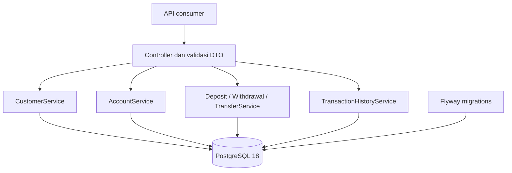

# Arsitektur Milestone 1

LedgerBank memakai modular monolith dengan package berdasarkan fitur. Seluruh perubahan uang berada dalam satu database PostgreSQL 18.

## Tanggung jawab fitur

| Package | Tanggung jawab |
|---|---|
| `customer` | Membuat dan membaca customer, menormalkan email, memastikan email unik |
| `account` | Membuka rekening, membuat nomor rekening dari sequence, membaca rekening, aturan status dan saldo |
| `transaction` | Deposit, withdrawal, histori per rekening, pagination |
| `transfer` | Transfer internal serta hubungan antara dua catatan pergerakan saldo |
| `common` | Health endpoint, validasi uang, format error |

Controller hanya menerima DTO dan mengembalikan response DTO. Service menentukan transaksi database. Repository mengakses JPA dan PostgreSQL. Entity memiliki perilaku terkait domain, termasuk penolakan saldo tidak cukup dan rekening tidak aktif.

## Batas transaksi uang

Deposit dan withdrawal berjalan di dalam `@Transactional`: validasi amount, kunci rekening dengan pessimistic write lock, ubah saldo, lalu simpan histori. Kegagalan pencatatan membatalkan perubahan saldo.

Transfer membuka satu database transaction untuk seluruh operasi berikut:

1. Validasi amount, identitas rekening berbeda, dan panjang description.
2. Kunci kedua rekening dengan urutan perbandingan UUID Java yang konsisten pada setiap transfer.
3. Periksa status ACTIVE, currency yang sama, saldo sumber, dan kapasitas saldo tujuan.
4. Debit sumber dan credit tujuan.
5. Simpan satu `Transfer` berstatus SUCCESS, satu `TRANSFER_DEBIT`, dan satu `TRANSFER_CREDIT`.
6. Commit seluruh perubahan. Exception membatalkan saldo, header transfer, dan kedua histori.

`saveAndFlush` mengirim write ke database tetapi tidak melakukan commit tersendiri. Lock tetap dipegang sampai transaction selesai. Timeout lock diatur 5 detik. Pengujian integrasi memaksa kegagalan penulisan histori tujuan sesudah header dan histori debit di-flush, lalu memeriksa rollback melalui koneksi database terpisah.

Lock dasar sudah dipakai pada Milestone 1 untuk melindungi perubahan saldo dari lost update. Idempotency, pengujian concurrency yang lebih luas, dan kebijakan retry tetap menjadi pengembangan selanjutnya.

## Histori dan uang

`AccountTransaction` adalah nama entity implementasi untuk entitas `Transaction` pada spesifikasi. Deposit/withdrawal menghasilkan satu catatan; transfer menghasilkan dua catatan yang terhubung melalui `transferId`. Entity histori dan transfer ditandai immutable pada Hibernate; tidak ada endpoint edit/delete. Ini bukan general ledger akuntansi bank lengkap, dan bukan pembatasan terhadap administrator yang mengakses SQL langsung.

Uang menggunakan `BigDecimal` dan `NUMERIC(19,2)`. Nilai positif dapat disimpan tepat hingga dua angka pecahan; nilai dengan pecahan lebih presisi ditolak tanpa pembulatan. Maksimum amount atau saldo adalah `99999999999999999.99`.

Histori diurutkan `createdAt DESC, id DESC`. ID menjadi pembeda ketika timestamp sama. Pagination stabil untuk data yang tidak berubah; model offset tidak menjanjikan snapshot konsisten selama transaksi baru masuk.

## Batas cakupan

API hanya mendukung IDR, deposit/withdrawal simulasi dan transfer internal. Transfer gagal tidak meninggalkan header SUCCESS atau histori parsial; pencatatan percobaan gagal sebagai audit terpisah belum termasuk M1. Tidak ada login, Redis, RabbitMQ, integrasi payment rail, atau klaim compliance perbankan.
